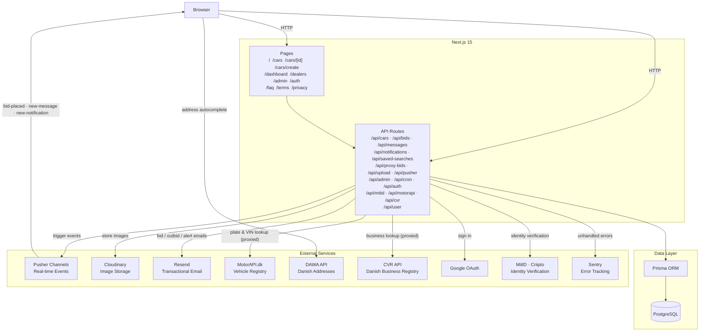

# Next Auction

[](https://github.com/JVDZMN/next-auction/actions/workflows/ci.yml)

A full-stack car auction platform built with Next.js 15, Prisma, and PostgreSQL. Users can list cars for auction, bid in real time, and track results — with the full auction lifecycle handled automatically.

## Performance

Measured with PageSpeed Insights:

| Metric | Mobile | Desktop |
|--------|--------|---------|
| Performance | 91 / 100 | 99 / 100 |
| Accessibility | 92 / 100 | 92 / 100 |
| Best Practices | 100 / 100 | 100 / 100 |
| SEO | 92 / 100 | 92 / 100 |
| LCP | 3.8s | 0.7s |
| FCP | 1.2s | 0.3s |
| TBT | 20ms | 0ms |

## Vercel Speed Insights (Real Users)

| Metric | Score |
|--------|-------|
| Real Experience Score | 100 / 100 |
| LCP | 1.32s |
| FCP | 1.1s |
| INP | 16ms |
| CLS | 0 |
| TTFB | 0.63s |

All routes scored 100/100. Measured from real user visits.

## Load Test (k6)

50 concurrent users, 40 seconds:

| Metric | Result |
|--------|--------|
| Total requests | 754 |
| Error rate | 0% |
| Average response | 273ms |
| p90 response | 336ms |
| p99 response | 718ms |
| Threshold (p99 < 2s) | ✅ passed |

---

## Architecture



## Tech Stack

| Layer | Technology |
|---|---|
| Framework | Next.js 15 (App Router) |
| Database | PostgreSQL + Prisma ORM |
| Auth | NextAuth.js (Google OAuth + credentials) |
| Identity verification | MitID via Criipto / Idura broker |
| Real-time | Pusher Channels — sub-second bid updates (< 1s measured, Vercel production) |
| Email | Resend |
| Image upload | Cloudinary |
| Error tracking | Sentry |
| Styling | Tailwind CSS + base-ui components |
| i18n | Built-in — Danish (`da`) and English (`en`) via `[locale]` routing |
| Testing | Vitest (unit) + Vitest + Docker (integration) |

## Features

### Listings & Search
- **Browse & search** — Filter by brand, model, city, fuel type, body type, price range, year range, KM range, inspection status; sort by newest / ending soon / price
- **Private vs business market** — Separate segments for private and business auctions; logged-in users can toggle between them
- **Map view** — Toggle a Leaflet map overlay on the listings page showing cars as pins; works alongside the filter panel
- **Liked cars filter** — Logged-in users can filter to show only their liked listings
- **Pagination** — 12 per page, shareable URLs preserve all active filters
- **Car cards** — Image, fuel/body type badges, km, city, time-left countdown (turns red under 24 h), bid count, live price via Pusher

### Car Creation
- **Vehicle lookup** — Enter a Danish license plate or VIN to auto-fill brand, model, specs, inspection dates, and more via [MotorAPI.dk](https://motorapi.dk)
- **DAWA address autocomplete** — Type-ahead search for Danish addresses ([Danmarks Adresseregister](https://api.dataforsyningen.dk)); fills street, house number, zip, and city
- **Location picker** — Interactive map pin for precise car location
- **Extended vehicle fields** — Sub-model, variant, body type, category, gear type, engine size, seats, weight, license plate, use, first registration, last/next inspection, KM at last inspection
- **Image upload** — Multi-image upload to Cloudinary
- **Draft mode** — Save a listing as a draft before publishing
- **Saved search alerts** — Users with matching saved searches are emailed when a new listing is published

### Bidding
- **Live updates** — Pusher `bid-placed` event pushes new price to every open car page the instant a bid lands; no polling
- **Quick-bid buttons** — Preset increment buttons on the car detail page for one-tap bidding
- **Mobile sticky bid bar** — Fixed bottom bar on mobile with the current price and bid button always in reach
- **Race condition protection** — Optimistic lock via `car.updateMany({ where: { currentPrice: snapshot } })`; if another bid landed first, `count === 0` and a 409 is returned immediately
- **Rate limiting** — 5 bids / 10 s per user; 10 messages / 60 s per user (Upstash Redis sliding-window; in-memory fallback for local dev)
- **Proxy bidding** — Set a maximum bid; system auto-bids up to that amount
- **Anti-sniping** — Last-minute bids extend the auction end time by a configurable number of minutes
- **Reserve price** — Owner sets a hidden minimum; auction closes as `reserve_not_met` if not reached
- **Second-chance offer** — Owner can accept the highest bid after a `reserve_not_met` close
- **Bid increment** — Optional minimum step between bids
- **Bid history** — Full bid history visible to all users; bidder names are anonymized (e.g. "Bruger #3")

### Auction Lifecycle
- **Status automation** — Cron endpoint (`/api/cron/auction-status`) runs on ended auctions and sets status automatically
- **Owner controls** — Cancel, relist, or duplicate a listing from the detail page
- **Winner flow** — Completed auctions record a winning bid and notify the winner
- **Dispute resolution** — Buyers and sellers can open a dispute on a completed auction; admins resolve from the admin panel

### Users & Trust
- **Email verification** — Credential signups receive a verification link; Google signups are auto-verified
- **MitID verification** — Danish users can verify their identity via MitID (separate from login)
- **Seller verification** — Admins can mark sellers as verified; badge shown on listings
- **Like / watchlist** — Heart listings; optionally receive an email when an auction is closing soon
- **GDPR data export** — Users can request and download all their personal data via `/api/user/gdpr`
- **User ratings** — Buyers and sellers can rate each other after a completed transaction
- **Business profiles** — Business users can edit a public dealer profile visible on the dealers page; CVR number looked up via the Danish business registry

### Notifications & Messaging
- **Notification bell** — Real-time bell icon with unread count; items are clickable and navigate to the relevant auction or message thread
- **Outbid toast** — Instant Pusher-driven toast when another user outbids you, with a direct link to the auction
- **Buyer ↔ seller chat** — Per-listing messaging with email fallback via Resend
- **Saved search alerts** — Email notification when a new listing matches a saved search

### Admin
- **Dashboard** — Platform stats (active listings, bids placed, users, revenue)
- **Car management** — View listings in any status (active, completed, cancelled, reserve_not_met)
- **Bid history** — Per-listing bid log in the admin panel
- **Users & sellers** — User list, seller verification, dispute resolution
- **Analytics** — Charts for platform activity over time

### Internationalisation
- **Danish and English** — All UI strings live in `lib/i18n/da.json` and `lib/i18n/en.json`; no hardcoded translated strings in components
- **`[locale]` routing** — All pages live under `/da/...` or `/en/...`; locale is resolved from the URL segment and injected via `DictionaryProvider`
- **Language switcher** — Header control switches locale while preserving the current path

### Developer
- **Structured logging** — JSON logs on every bid attempt/rejection/success; unexpected errors captured to Sentry
- **Error boundaries** — `app/error.tsx` and `app/global-error.tsx` show recovery UI instead of a white screen
- **CI** — GitHub Actions runs lint + tests + type check on every push and PR

---

## Technical Highlights

### Concurrent bid safety
Two users submitting the same bid amount at the same millisecond is the classic auction race condition. The solution uses two layers of defence:

1. **Optimistic lock** — `car.updateMany({ where: { id, currentPrice: snapshot } })`: if the price changed between the read and the write, `count === 0` and the bid returns a 409 immediately. This is the primary guard and works correctly across all Postgres drivers without requiring serializable transactions.
2. **Input validation** — `validateBid()` rejects bids below the minimum increment, from the car's owner, or after auction end before any DB write occurs.

The optimistic lock is covered by unit tests and an integration test that fires 20 concurrent bids and asserts exactly one succeeds.

### Fire-and-forget side effects
Post-bid work (outbid emails, in-app notifications, Pusher events) runs in a `void (async () => { ... })()` block after the bid is written. The bid response is returned immediately without waiting for emails to send. Failures in this block are caught, logged to Sentry, and do not affect the bid result. This keeps p99 bid latency low even when Resend is slow.

### MotorAPI proxy
The Danish vehicle registry (MotorAPI.dk) requires an API token that must not be exposed to the browser. `/api/motorapi` proxies the request server-side, maps the raw response fields (fuel type, gear type, dates, engine volume in cc → litres) to the form's field names, and returns only what the form needs. The browser never sees the token.

### Env-var validation at startup
`lib/env.ts` is imported in `instrumentation.ts` (Next.js server startup hook). If a required variable is missing the server refuses to start with a clear error listing exactly which variables are absent, rather than crashing at runtime on the first request that needs them.

---

## Security

| Concern | Approach |
|---|---|
| Authentication | NextAuth.js — session cookie (httpOnly, sameSite=lax) |
| Authorisation | Every mutating route checks `requireAuth()` or `requireAdmin()` before touching the DB |
| Input validation | Zod schemas on all POST/PATCH bodies; Prisma parameterised queries prevent SQL injection |
| Rate limiting | 5 bids / 10 s and 10 messages / 60 s per user (Upstash Redis sliding window) |
| Owner self-bid | Validated in `bid-validation.ts` — returns 403 before the transaction opens |
| API token exposure | MotorAPI token never leaves the server; proxied via `/api/motorapi` |
| Env vars at startup | Missing required variables throw at boot, not at request time |
| Error detail leakage | `serverError()` logs the full error server-side but returns only a generic message to the client |

---

## Deployment

The app is designed for **Vercel** (zero-config for Next.js App Router). Use a managed Postgres provider such as Neon, Supabase, or Railway for the database.

### Steps

1. Push to GitHub and import the repo in Vercel.
2. Set all environment variables listed in `.env.example` in the Vercel dashboard.
3. Run the initial migration against your production database:
   ```bash
   DATABASE_URL=<prod-url> npx prisma migrate deploy
   ```
4. Add a Vercel Cron job to keep auction statuses up to date:
   ```json
   // vercel.json
   {
     "crons": [{ "path": "/api/cron/auction-status", "schedule": "*/5 * * * *" }]
   }
   ```

---

## Getting Started

### Prerequisites

- Node.js 22+
- Docker (for the local dev database) or a PostgreSQL 15+ instance

### Setup

```bash
# 1. Start the local dev database (Postgres on port 5434)
docker compose up -d

# 2. Install dependencies
npm install

# 3. Copy and fill in environment variables
cp .env.example .env

# 4. Run migrations and start the dev server
npx prisma migrate dev
npm run dev
```

Open [http://localhost:3000](http://localhost:3000).

### Environment Variables

See [.env.example](.env.example) for the full list.

```
DATABASE_URL
NEXTAUTH_SECRET
NEXTAUTH_URL
NEXT_PUBLIC_APP_URL
RESEND_API_KEY
EMAIL_FROM
CLOUDINARY_CLOUD_NAME
CLOUDINARY_API_KEY
CLOUDINARY_API_SECRET
CRON_SECRET              # protects /api/cron/auction-status
MOTORAPI_TOKEN           # MotorAPI.dk free-tier token for vehicle lookup
GOOGLE_CLIENT_ID
GOOGLE_CLIENT_SECRET
CRIIPTO_CLIENT_ID        # MitID via Idura broker (optional)
CRIIPTO_CLIENT_SECRET
CRIIPTO_DOMAIN
PUSHER_APP_ID
PUSHER_KEY
PUSHER_SECRET
PUSHER_CLUSTER
NEXT_PUBLIC_PUSHER_KEY
NEXT_PUBLIC_PUSHER_CLUSTER
UPSTASH_REDIS_REST_URL   # optional — falls back to in-memory rate limiter if absent
UPSTASH_REDIS_REST_TOKEN
NEXT_PUBLIC_SENTRY_DSN   # optional
SENTRY_DSN               # optional
```

---

## Project Structure

```
next-auction/
├── app/
│   ├── [locale]/                  # All pages under /da/... or /en/...
│   │   ├── page.tsx               # Home
│   │   ├── layout.tsx             # Locale layout — injects session, dict, providers
│   │   ├── cars/
│   │   │   ├── page.tsx           # Browse — search, filters, map, pagination
│   │   │   ├── CarsClient.tsx
│   │   │   ├── create/            # Create listing form
│   │   │   └── [id]/              # Car detail + bidding
│   │   ├── dashboard/             # User dashboard (listings, bids, searches, messages, analytics)
│   │   │   └── profile/           # Business profile editor
│   │   ├── dealers/               # Dealer directory
│   │   │   └── [dealerId]/        # Individual dealer page
│   │   ├── admin/                 # Admin panel
│   │   │   ├── dashboard/
│   │   │   └── cars/
│   │   ├── auth/                  # Sign in / sign up / verify-email
│   │   ├── faq/
│   │   ├── terms/
│   │   ├── privacy/
│   │   └── mitid-verified/
│   ├── api/
│   │   ├── auth/                  # NextAuth + credentials register + email verify
│   │   ├── bids/                  # Place & list bids
│   │   ├── cars/                  # CRUD, search/pagination, like, status, accept-bid, relist, duplicate, dispute, rating, view
│   │   ├── motorapi/              # Vehicle lookup proxy (MotorAPI.dk)
│   │   ├── cvr/                   # Danish business registry lookup proxy
│   │   ├── messages/              # Buyer ↔ seller chat
│   │   ├── notifications/         # In-app notification list + mark-read
│   │   ├── saved-searches/        # CRUD for saved searches
│   │   ├── proxy-bids/            # Proxy bid management
│   │   ├── pusher/                # Pusher auth endpoint
│   │   ├── upload/                # Cloudinary image upload
│   │   ├── admin/                 # Admin stats & car management
│   │   ├── user/                  # Dashboard data, profile, analytics, GDPR export
│   │   ├── users/                 # User lookup (admin)
│   │   ├── mitid/                 # MitID OIDC start + callback
│   │   └── cron/                  # Auction status updater
│   ├── error.tsx
│   ├── global-error.tsx
│   ├── not-found.tsx
│   ├── robots.ts
│   └── sitemap.ts
├── components/
│   ├── car-create/
│   │   ├── VehicleLookupPanel.tsx   # MotorAPI license plate / VIN lookup
│   │   ├── CarAddressSection.tsx    # DAWA autocomplete + manual address fields
│   │   ├── CarLocationPicker.tsx    # Map pin for car location
│   │   ├── CarVehicleSection.tsx    # Brand / model / sub-model / description
│   │   ├── CarSpecsSection.tsx      # Year, KM, fuel, gear, body type, etc.
│   │   ├── CarAuctionSection.tsx    # Prices, dates, bid increment
│   │   └── CarDocsSection.tsx       # VIN, inspections, URLs, notes
│   ├── car-detail/
│   │   ├── CarHeader.tsx
│   │   ├── CarSpecs.tsx
│   │   └── OwnerActions.tsx
│   ├── bidding/
│   │   ├── PlaceBidForm.tsx         # Main bid form with quick-bid buttons
│   │   ├── ProxyBidForm.tsx
│   │   ├── BidHistoryTable.tsx      # Anonymized bid history (visible to all)
│   │   ├── BidConfirmDialog.tsx
│   │   └── AuctionStatusAlerts.tsx
│   ├── dashboard/
│   │   ├── ProfileCard.tsx
│   │   ├── StatsGrid.tsx
│   │   ├── MyAuctionsTab.tsx
│   │   ├── MyBidsTab.tsx
│   │   ├── SavedSearchesTab.tsx
│   │   ├── MessagesTab.tsx
│   │   └── AnalyticsTab.tsx
│   ├── admin/
│   │   ├── OverviewTab.tsx
│   │   ├── CarsTab.tsx
│   │   ├── UsersTab.tsx
│   │   ├── SellersTab.tsx
│   │   ├── BiddersTab.tsx
│   │   ├── ChartsTab.tsx
│   │   ├── DisputeResolution.tsx
│   │   ├── AdminBidsTable.tsx
│   │   └── AdminBidStats.tsx
│   ├── header/
│   │   ├── NotificationBell.tsx     # Real-time bell with unread count + clickable items
│   │   ├── MobileSheet.tsx
│   │   └── UserMenu.tsx
│   ├── home/                        # Home page section components
│   ├── cars/
│   │   ├── CarGrid.tsx
│   │   └── FilterPanel.tsx
│   ├── Header.tsx
│   ├── CarCard.tsx                  # Listing card — image, badges, time left, live price
│   ├── CarsMap.tsx                  # Leaflet map view of listings
│   ├── BiddingSection.tsx
│   ├── DawaAddressInput.tsx         # DAWA type-ahead address input
│   ├── CarImageUpload.tsx
│   ├── CarImageGallery.tsx
│   ├── LikeButton.tsx
│   ├── DisputeSection.tsx
│   ├── PaymentSection.tsx
│   ├── LanguageSwitcher.tsx
│   ├── AuctionCountdown.tsx
│   └── PageLayout.tsx
├── lib/
│   ├── services/
│   │   ├── bid-service.ts                    # placeBid — transaction, proxy bid, anti-sniping
│   │   ├── bid-service.test.ts               # Unit tests (mocked)
│   │   └── bid-service.integration.test.ts   # Integration tests (real Postgres)
│   ├── i18n/
│   │   ├── index.ts           # locales, getDictionary, toLocale
│   │   └── context.tsx        # DictionaryProvider, useLocale, useDict
│   ├── test/
│   │   ├── db.ts              # Test DB client + ensureMigrated / resetDb / seed helpers
│   │   └── setup.ts           # Dummy env vars for test runs
│   ├── bid-validation.ts
│   ├── bid-error.ts
│   ├── rate-limit.ts
│   ├── logger.ts
│   ├── email.ts
│   ├── auth.ts
│   ├── prisma.ts
│   ├── env.ts                 # Startup env-var validation
│   ├── notification-context.tsx
│   ├── car-brands.ts          # getAllBrands / getModelsByBrand / getSubModelsByBrandModel
│   ├── car-filters.ts
│   ├── pusher.ts / pusher-client.ts
│   ├── cloudinary.ts
│   ├── permissions.ts
│   ├── api.ts                 # serverError helper
│   └── zod.ts                 # Input validation schemas
├── data/
│   └── car-brands.json        # Hierarchical brand → model → sub_model list (Denmark)
├── prisma/
│   └── schema.prisma
├── types/
│   ├── car.ts
│   └── next-auth.d.ts
├── .github/workflows/
│   └── ci.yml
└── .env.example
```

---

## API Routes

| Method | Route | Auth | Description |
|---|---|---|---|
| GET | `/api/cars` | — | List cars with filters + pagination |
| POST | `/api/cars` | User | Create listing |
| GET | `/api/cars/[id]` | — | Car detail |
| PATCH | `/api/cars/[id]` | Owner/Admin | Update listing fields |
| PATCH | `/api/cars/[id]/status` | Owner/Admin | Update auction status |
| POST | `/api/cars/[id]/like` | User | Toggle like |
| POST | `/api/cars/[id]/accept-bid` | Owner | Accept highest bid (reserve not met) |
| POST | `/api/cars/[id]/relist` | Owner | Relist with new end date |
| POST | `/api/cars/[id]/duplicate` | Owner | Duplicate as draft |
| POST | `/api/cars/[id]/view` | — | Increment view count |
| POST | `/api/cars/[id]/dispute` | User | Open a dispute on a completed auction |
| POST | `/api/cars/[id]/rating` | User | Submit a rating after a transaction |
| GET | `/api/motorapi` | User | Vehicle lookup by plate or VIN |
| GET | `/api/cvr` | User | Danish business registry lookup by CVR number |
| GET/POST | `/api/bids` | User | List / place bids |
| GET/POST | `/api/proxy-bids` | User | Get / set proxy bid for a car |
| GET/POST | `/api/messages` | User | Fetch / send messages |
| GET/PATCH | `/api/notifications` | User | Notification list / mark read |
| GET/POST/DELETE | `/api/saved-searches` | User | Manage saved searches |
| POST | `/api/pusher/auth` | User | Pusher channel auth |
| POST | `/api/upload` | User | Upload images to Cloudinary |
| GET | `/api/admin/stats` | Admin | Platform statistics |
| GET | `/api/admin/cars/[id]` | Admin | Car detail with bid stats |
| GET | `/api/user/dashboard` | User | Full dashboard data |
| GET/PATCH | `/api/user/profile` | User | User profile read/update |
| GET | `/api/user/analytics` | User | Personal bidding/listing analytics |
| GET | `/api/user/gdpr` | User | GDPR data export |
| GET | `/api/auth/verify-email` | — | Verify email token |
| GET | `/api/mitid/start` | — | Start MitID OIDC flow |
| GET | `/api/mitid/callback` | — | MitID OIDC callback |
| GET | `/api/cron/auction-status` | Cron secret | Update ended auction statuses |

### GET /api/cars — Query Parameters

| Param | Type | Description |
|---|---|---|
| `brand` | string | Exact brand match |
| `model` | string | Model contains (case-insensitive) |
| `city` | string | City contains (case-insensitive) |
| `fuel` | string | Exact fuel type (`Benzin`, `Diesel`, `Electric`, …) |
| `bodyType` | string | Body type contains (case-insensitive) |
| `minPrice` / `maxPrice` | number | Current price range |
| `minYear` / `maxYear` | number | Year range |
| `minKm` / `maxKm` | number | Odometer range |
| `synStatus` | string | Inspection status: `valid` (next inspection in future) · `expired` |
| `segment` | string | Market segment: `private` (default) · `business` |
| `liked` | `true` | Only cars liked by the authenticated user |
| `sortBy` | string | `newest` (default) · `endingSoon` · `priceAsc` · `priceDesc` |
| `page` | number | Page number (default 1) |
| `pageSize` | number | Items per page (default 12, max 48) |

Response: `{ cars, total, page, pageSize, totalPages }`

---

## Auction Status Logic

The cron endpoint (`/api/cron/auction-status`) runs on ended auctions:

| Condition | Status set |
|---|---|
| No bids | `cancelled` |
| Bids exist, highest < reserve | `reserve_not_met` |
| Bids exist, reserve met (or no reserve) | `completed` |

Trigger on a schedule (e.g. Vercel Cron):

```json
{
  "crons": [{ "path": "/api/cron/auction-status", "schedule": "*/5 * * * *" }]
}
```

---

## Bidding Rules

1. Bid must be strictly higher than `currentPrice`
2. Auction must have `active` status and not have passed its end date
3. Owner cannot bid on their own listing
4. Maximum 5 bids per 10 seconds per user
5. Two concurrent bids resolve atomically — first to commit wins, second gets 409

---

## Database Schema

```
User ──< Car ──< Bid
              ──< Message
              ──< Like
              ──< ProxyBid
              ──< Dispute
              ──< Rating
User ──< Notification
User ──< SavedSearch
User ── VerificationToken
```

---

## Testing

### Unit tests

```bash
npm test              # Run all unit tests (~500 ms, no DB required)
npm run test:watch    # Watch mode
npm run test:coverage # Coverage report
```

### Integration tests

Require Docker. The script starts a throwaway Postgres container, runs migrations, executes the tests, then tears everything down:

```bash
npm run test:integration
```

What the integration tests prove:

- Optimistic locking (`updateMany WHERE currentPrice = snapshot`) prevents two concurrent bids both winning
- Under a 20-bid storm, exactly one bid commits and the rest get clean 400/409 errors
- `winnerBidId` on the car always points to the single committed bid
- Invalid bids (expired auction, owner self-bid, non-existent car, amount too low) are rejected with the correct HTTP status and leave the database unchanged
- Anti-sniping extension fires only when a bid lands inside the configured window

The test database runs on port **5433** (dev DB is on 5434) using an in-memory `tmpfs` mount for maximum speed.

---

## Scripts

```bash
npm run dev                # Start dev server
npm test                   # Unit tests (Vitest, no DB)
npm run test:watch         # Unit tests in watch mode
npm run test:coverage      # Coverage report
npm run test:integration   # Integration tests (starts/stops Docker automatically)
npm run lint               # ESLint
```
